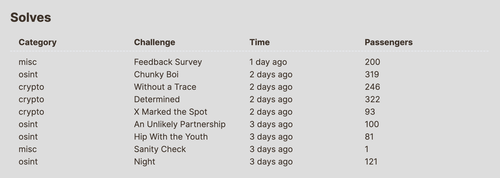
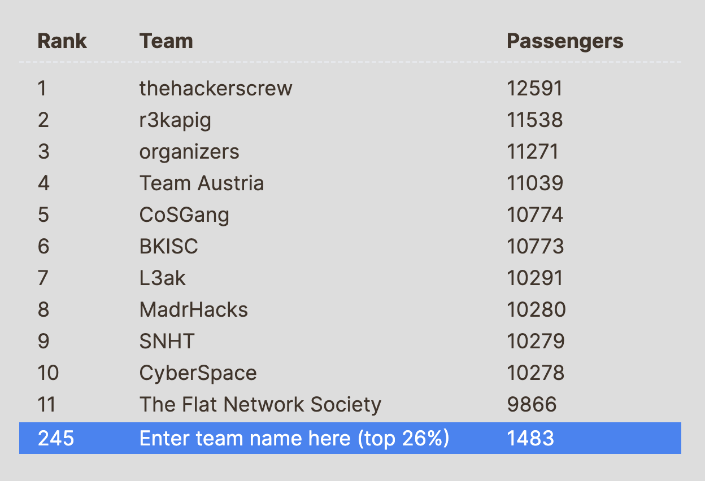

    
     
     
     
     
     
    <h1>UIUCTF 2024</h1>
    

        UIUCTF is an annual capture-the-flag competition hosted by <a href="https://sigpwny.com/">SIGPwny</a>, the cybersecurity club at the University of Illinois Urbana-Champaign (UIUC).
    

 
 

## Prizes

- 🥇 $2048
- 🥈 $1024
- 🥉 $512
- 🎗️ $256 *for 4th and 5th place*
- 🎉 $128 *for 6th to 10th place*

 
 

## Challenges

- ⚙️ **Pwn**  
    - *Rusty Pointers*
    - *Syscall*
    - *Syscall 2*
    - *Backup Power*
    - *pwnymalloc*
- 🔧 **Reverse Engineering**
    - *Time travel*
    - *Pwnymaps*
    - *Summarize*
    - *tooooo fancy 😏*
    - *Goose Chase*
    - *Wild Goose Chase*
    - *Lost Canary*
- 🔐 **Cryptography**
    - *Groups* 
    - *Key in a Haystack* 
    - *Snore Signatures* 
    - *Without a trace* ✅
    - [*Determined*](./Crypto/Determined/README.md) ✅
    - *X Marked the Spot* ✅
    - *Naptime* 
- 🌎 **OSINT**
    - *The Weakest Link*
    - *An Unlikely Partnership* ✅
    - *Hip with the Yoouth* ✅
    - *Night* ✅
    - *New Dallas*
    - *Chubky Boi* ✅
- 🌐 **Web**  
    - *Log Action*
    - *Fare Evasion*
    - *pwnypass*
    - *pwnypass 2*
- ☎️ **Miscellaneous**
    - *Picoify*
    - *Astea*
    - *Slot Machine*
    - *Push and Pickle*

 
 

## Team

 ***[Enter team name here](https://th.bing.com/th/id/OIG4.ViQb2zkNrXoe.Cdu2o92?pid=ImgGn)***

 

 
 
