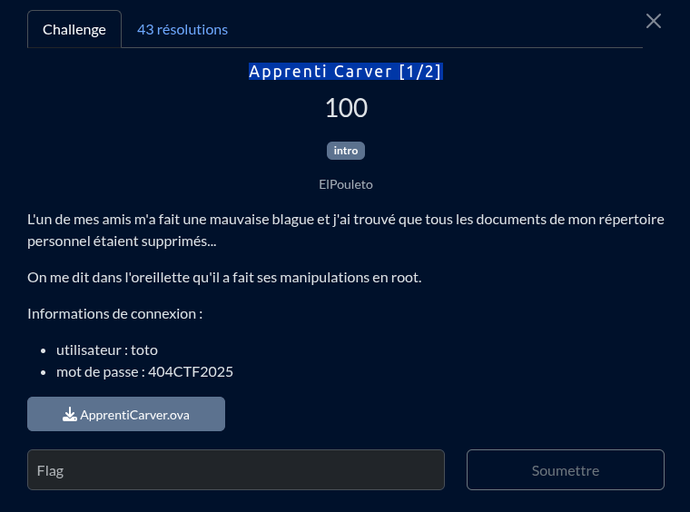
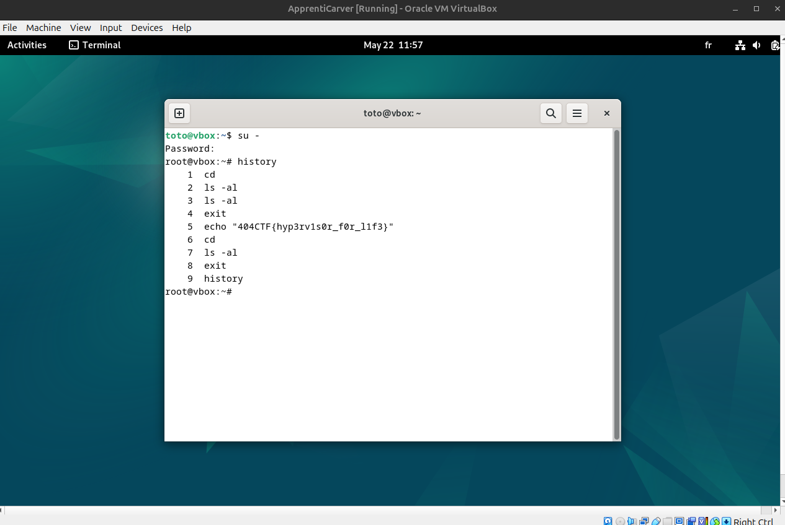

Une fois connecter sur la session de toto, il suffit juste de se co en tant que `root`, le mdp étant le même que toto (on peut voir que tote à l'id 1000, qui est l'id du premier user donc son mdp sera par default le même pour root)

Une simple command history permet de voir toute les actions récemment fait par root

et donc de voir le flag en clair