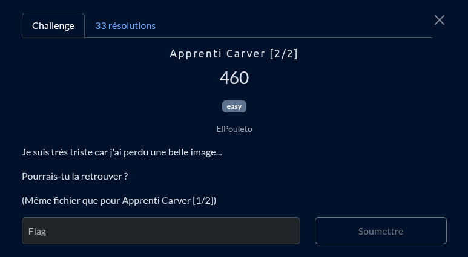
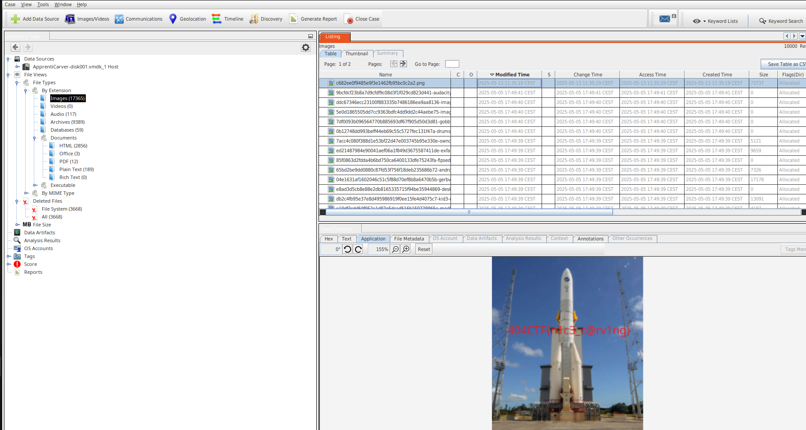

Cette fois on doit retrouver une image qui a été éffacé, ducoup [autopsy](https://www.autopsy.com/) fera très bien l'affaire pour ça.
Je prends just soin de "untar" le fichier ova donnée pour y retrouver le .vmdk, et je setup mon projet ***autopsy*** en lui donnant le .vmdk du challenge

après le setup fait je vais regarder tout suite dans la section "image" et trié la montagne d'image par date de modification comme je m'attends à ce que le fichier en question ai été manipulé par le chall maker en dernier sur cette machine

et par chance c'est vraiment la toute dernier image qui sera le flag !