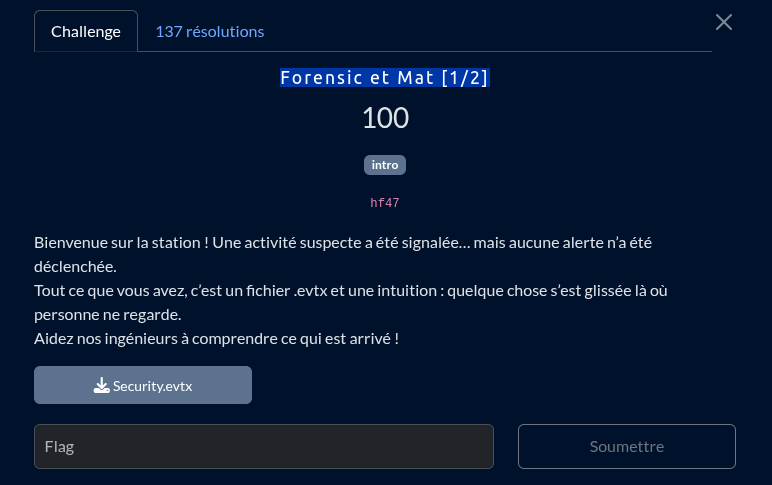

on a un fichier de log de vieux windows vista, j'ai pas de windows sous la main main en vrai trkl

je demarre avec la commande `strings` dessus mais ça donne rien, surement un formatage bien specific à windows, ducoup je fais un dump dessus

```bash
xxd resources/Security.evtx > out.txt 
```

et j'ouvre le dump avec mon vscode

en scrollant je remarque un pattern bien spécific, on remarque que les noms des éxecutable sont séparé par des `.`
ducoup avec un CTRL+F bien précis tel le sniper =>


hehe, on file ça à chatGPT 


et hop ! (se troll à oublié le `!` à la fin) on a le flag
