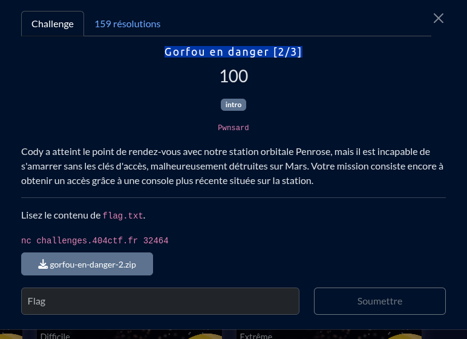

1. Premierement on constate facilement qu'un *buffer overflow* est possible dans la fonction `take_command`, ceci qui nous permet de réecrire l'address de retour du registre `rip` pour arbitrairement 
jump où l'on veut

2. Deuxiement On a la fonction `debug_info` qui quand à elle nous affiche plusieur information dont une important
```c
    void* local_var = NULL;
    printf("Stack address : %p\n", &local_var);
```
l'addresse de la stack dans cette même fonction 

3. Et pour finir on constate qu'aucune sécurité n'est activé, on peut:
- overflow sans problème vu qu'il n'y a pas de canary
- Les addresses des fonction  ne sont pas randomisé
- On peut éxecuter la stack

Avvec toute ces informations, le plan final sera de 

1. Profiter du buffer overflow pour jump arbitraire dans `debug_info` et récuperer le leak

2. Après le leak retourner dans la fonction `take_command`

3. Cette fois ci push le shellcode (qui nous ai donné par le chall maker dans `generate_shellcode`) sur la stack puis en utilsant l'address leak de la stack réecrire `rip` (en trouvant le bonne offset) pour le faire pointer vers le notre shellcode

4. Run et obtenir le shell !

## flag

404CTF{c3cI_E5T_mA_574ti0n_QUe_voU5_voyE2,_D3rr1Èr3,_lÀ._Pa5_M@L,_nOn_?}