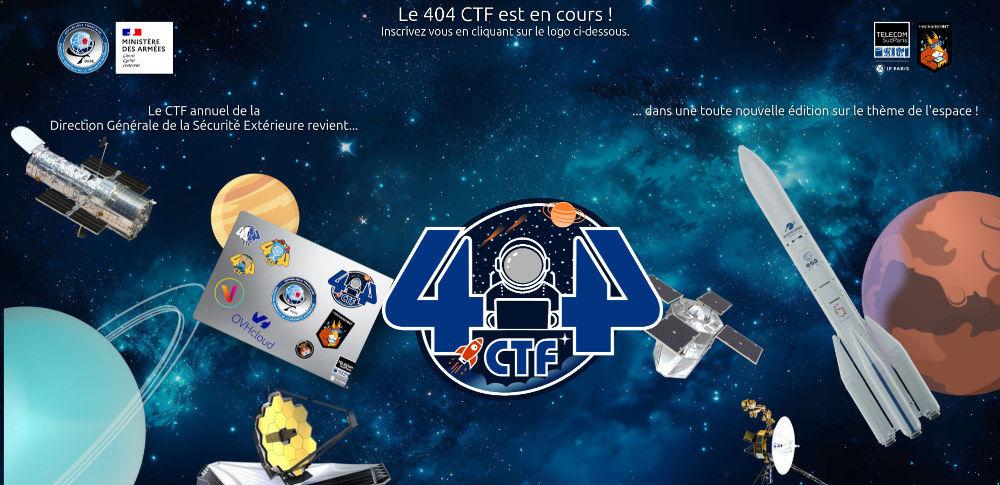
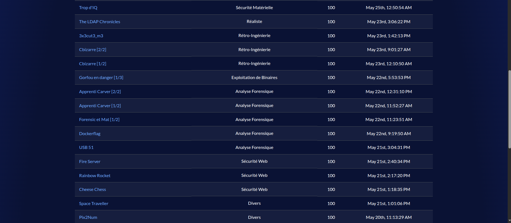

 
 

## Challenges

- 🐈‍⬛ **Algorithmique quantique** - *Quantum computing*  
    - Machinerie quantique
    - Grover (1/2)
    - Grover (2/2)
- 🔐 **Cryptanalyse** - *Cryptanalysis*  
    - [Message lointain](./Cryptanalyse/Message%20lointain)
    - [Entretien galactique](./Cryptanalyse/Entretien%20galactique)
    - [R1R2](./Cryptanalyse/R1R2)
    - Saturn Cipher
    - Planètes anormales
    - Spacemark
    - You spin me round
    - Dérive dans l'espace
    - Lunette cosmico galactique
    - Entretien Galactique 2
    - Lunette cosmico galactique revanche
    - Jupiter Cipher
    - Courbe de Lancement
    - More Space
- ☎️ **Divers** - *Miscellaneous*
    - [Pix2Num](./Divers/Pix2Num)
    - [Space Traveller](./Divers/Space%20Traveller)
    - Satellisation
    - Étoile binaire [2/2]
- ⚙️ **Exploitation de binaires** - *Binary exploitation (Pwn)*  
    - [Gorfou en danger 1](./Exploitation%20de%20Binaires/Gorfou%20en%20danger%201)
    - [Gorfou en danger 2](./Exploitation%20de%20Binaires/Gorfou%20en%20danger%202)
    - [Gorfou en danger 3](./Exploitation%20de%20Binaires/Gorfou%20en%20danger%203)
    - [Spaaaaaaace](./Exploitation%20de%20Binaires/Spaaaaaaace)
    - [KerberINT Space Program](./Exploitation%20de%20Binaires/KerberINT%20Space%20Program)
    - 22 bytes pour sauver l'univers
    - Bounty Machine
    - Space Odyssey
    - Solaris
    - Cosmic-Base
    - Kalaxy
    - Bokit
- 🧠 **Intelligence artificielle** - *Artificial intelligence (AI)*  
    - [Gorfoustral-1-2-3](./Intelligence%20Artificielle/Gorfoustral-1-2-3)
    - Du tatouage
- 🔎 **Analyse Forensique** - *Digital forensics*  
    - [USB 51](./Analyse%20Forensique/USB%2051)
    - [Forensic et Mat-1](./Analyse%20Forensique/Forensic%20et%20Mat-1)
    - [Apprenti Carver-1](./Analyse%20Forensique/Apprenti%20Carver-1)
    - [Dockerflag](./Analyse%20Forensique/Dockerflag)
    - Forensic et Mat-2
    - [Apprenti Carver-2](./Analyse%20Forensique/Apprenti%20Carver-2)
    - Tape ton MDP
    - Toortik Triflexation [1/2]
- 🌎 **Renseignement en sources ouvertes** - *Open source intelligence (OSINT)*  
    - [L'addition est salée](./Renseignement%20en%20Sources%20Ouvertes/L'addition%20est%20sal%C3%A9e)
    - [Une mission inconnue](./Renseignement%20en%20Sources%20Ouvertes/Une%20mission%20inconnue)
    - [Earth attack 0](./Renseignement%20en%20Sources%20Ouvertes/Earth%20attack%200)
    - Un satellite qui vaut de l'or
    - Un peu de vacances
    - La ville en rose
    - Earth Attack (1/2)
    - La tête dans les étoiles
    - En eaux sombres
    - DPOsint
- 🔧 **Rétro-Ingénierie** - *Reverse Engineering*  
    - [Cbizarre-1](./Retro-Ingenierie/Cbizarre-1)
    - [Cbizarre-2](./Retro-Ingenierie/Cbizarre-2)
    - Reversconstrictor
    - [3x3cut3_m3](./Retro-Ingenierie/3x3cut3_m3)
    - Inscription
    - Étoile binaire [1/2]
    - RFC 9452 bis: IP over Rockets with Quality of Service
- 📟 **Sécurité matérielle** - *Hardware*  
    - [Trop dIQ](./Securit%C3%A9%20Materielle/Trop%20dIQ)
    - [Space Radio](./Securit%C3%A9%20Materielle/Space%20Radio)
    - R16D4
    - [Code Radiospatial n°1](./Securit%C3%A9%20Materielle/Code%20Radiospatial%20n%C2%B01)
    - Comment est votre température ?
    - Unidentified Serial Bus [1/2]
    - Unidentified Serial Bus [2/2]
- 🌐 **Sécurité Web**  
    - [Rainbow Rocket](./S%C3%A9curit%C3%A9%20Web/Rainbow%20Rocket)
    - [Fire Server](./S%C3%A9curit%C3%A9%20Web/Fire%20Server)
    - Sideral Noise
    - Space Fleet Command
- ❓ **Réaliste**  
    - [The LDAP Chronicles](./Realiste/The%20LDAP%20Chronicles)
    - Houston, we have a problem
    - Named Resolve
    - The AD Guardians
    - The GPO Mission
    - Ghost Membership

 
 

 
 

## Algorithmique quantique – Quantum computing

| Épreuve              | Points | Résolu |
|----------------------|--------|--------|
| Machinerie quantique | 100    | :x: |
| Grover (1/2)         | 211    | :x: |
| Grover (2/2)         | 488    | :x: |

## Cryptanalyse – Cryptanalysis

| Épreuve                                 | Points | Résolu |
|-----------------------------------------|--------|--------|
| Message lointain                        | 100    | :white_check_mark: |
| Entretien galactique                    | 100    | :white_check_mark: |
| R1R2                                    | 100    | :white_check_mark: |
| Saturn Cipher                           | 100    | :x: |
| Planètes anormales                      | 211    | :x: |
| Spacemark                               | 244    | :x: |
| You spin me round                       | 299    | :x: |
| Dérive dans l'espace                    | 477    | :x: |
| Lunette cosmico galactique              | 404    | :x: |
| Entretien Galactique 2                  | 471    | :x: |
| Lunette cosmico galactique revanche     | 494    | :x: |
| Jupiter Cipher                          | 496    | :x: |
| Courbe de Lancement                     | 495    | :x: |
| More Space                              | 499    | :x: |

## Divers – Miscellaneous

| Épreuve             | Points | Résolu |
|---------------------|--------|--------|
| Pix2Num             | 100    | :white_check_mark: |
| Space Traveller     | 100    | :white_check_mark: |
| Satellisation       | 490    | :xw    |
| Étoile binaire [2/2]| 500    | :xw    |

##  Exploitation de binaires – Binary exploitation (Pwn)

| Épreuve                       | Points | Résolu |
|-------------------------------|--------|--------|
| Gorfou en danger 1            |        | :white_check_mark: |
| Gorfou en danger 2            |        | :white_check_mark: |
| Gorfou en danger 3            |        | :white_check_mark: |
| Spaaaaaaace                   |        | :white_check_mark: |
| KerberINT Space Program       |        | :white_check_mark: |
| 22 bytes pour sauver l'univers|        | :x: |
| Bounty Machine                |        | :x: |
| Space Odyssey                 |        | :x: |
| Solaris                       |        | :x: |
| Cosmic-Base                   |        | :x: |
| Kalaxy                        |        | :x: |
| Bokit                         |        | :x: |

## Intelligence artificielle – Artificial Intelligence (AI)

| Épreuve             | Points | Résolu |
|---------------------|--------|--------|
| Gorfoustral-1       | 100    | :white_check_mark: |
| Gorfoustral-2       | 132    | :white_check_mark: |
| Gorfoustral-3       | 269    | :white_check_mark: |
| Du tatouage         | 467    | :x: |

## Analyse Forensique – Digital forensics

| Épreuve             | Points | Résolu |
|---------------------|--------|--------|
| USB 51              | 100    | :white_check_mark: |
| Forensic et Mat-1   | 100    | :white_check_mark: |
| Apprenti Carver-1   | 100    | :white_check_mark: |
| Dockerflag          | 100    | :white_check_mark: |
| Forensic et Mat-2   | 100    | :x: |
| Apprenti Carver-2   | 100    | :white_check_mark: |
| Tape ton MDP        | 100    | :x: |
| Toortik Triflexation [1/2] | 356 | :x: |

## Renseignement en sources ouvertes – OSINT

| Épreuve                        | Points | Résolu |
|--------------------------------|--------|--------|
| L'addition est salée           | 100    | :white_check_mark: |
| Une mission inconnue           | 100    | :white_check_mark: |
| Earth attack 0                 | 100    | :white_check_mark: |
| Un satellite qui vaut de l'or  | 100    | :x: |
| Un peu de vacances             | 100    | :x: |
| La ville en rose               | 100    | :x: |
| Earth Attack (1/2)             | 100    | :x: |
| La tête dans les étoiles       | 347    | :x: |
| En eaux sombres                | 464    | :x: |
| DPOsint                        | 498    | :x: |

## Rétro-Ingénierie – Reverse Engineering

| Épreuve                                                    | Points | Résolu |
|-------------------------------------------------------------|--------|--------|
| Cbizarre-1                                                  | 100    | :white_check_mark: |
| Cbizarre-2                                                  | 100    | :white_check_mark: |
| Reversconstrictor                                           | 100    | :x: |
| 3x3cut3_m3                                                  | 100    | :white_check_mark: |
| Inscription                                                 | 304    | :x: |
| Étoile binaire [1/2]                                        | 489    | :x: |
| RFC 9452 bis: IP over Rockets with Quality of Service       | 488    | :x: |

## Sécurité matérielle – Hardware

| Épreuve                        | Points | Résolu |
|--------------------------------|--------|--------|
| Trop dIQ                       | 100    | :white_check_mark: |
| Space Radio                    | 100    | :white_check_mark: |
| R16D4                          | 100    | :x: |
| Code Radiospatial n°1          | 100    | :white_check_mark: |
| Comment est votre température ?| 293    | :x: |
| Unidentified Serial Bus [1/2]  | 356    | :x: |
| Unidentified Serial Bus [2/2]  | 356    | :x: |

## Sécurité Web

| Épreuve             | Points | Résolu |
|---------------------|--------|--------|
| Rainbow Rocket      | 100    | :white_check_mark: |
| Fire Server         | 100    | :white_check_mark: |
| Sideral Noise       | 499    | :x: |
| Space Fleet Command | 473    | :x: |

## Réaliste

| Épreuve              | Points | Résolu |
|----------------------------|--------|--------|
| The LDAP Chronicles        | 100    | :white_check_mark: |
| Houston, we have a problem | 100    | :x: |
| Named Resolve              | 100    | :x: |
| The AD Guardians           | 100    | :x: |
| The GPO Mission            | 100    | :x: |
| Ghost Membership           | 100    | :x: |

