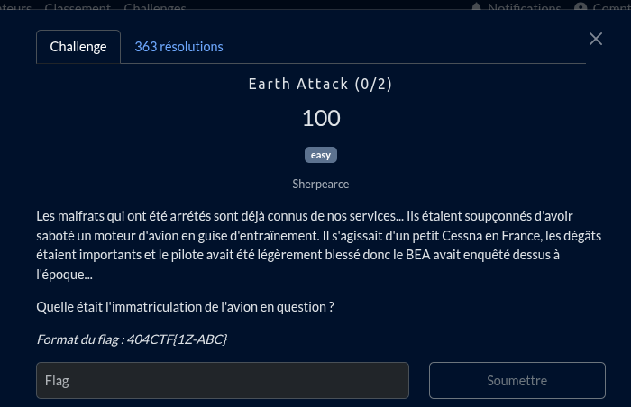

Dans la description, il est mentioné que "*le BEA avait enquêté dessus*", en faisant une recherche simple on tombe sur leur site https://bea.aero/ qui retrace tout les incidents aéronotique.

Avec la description du challenge, on peut filtrer assez facilement tout les accidents du même type https://bea.aero/les-enquetes/evenements-notifies/?tx_news_pi1%5Bpage%5D=2&cHash=c885e671b17f62439f9a2f6026b7ad64 

l'évènement => https://bea.aero/les-enquetes/evenements-notifies/detail/accident-du-cessna-206-immatricule-9h-mdj-survenu-le-19-12-2022-a-roura-973/

## Flag

404CTF{9H-MDJ}
