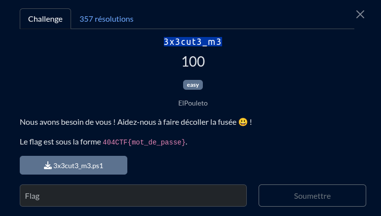

un simple scrip powershell mais celui ci semble avec un énorme payload, en regardant la partie du decode de celui, on y découvre, 
un autre payload encodé... et ceux de manière recursive 

j'ai utilisé [pwsh](https://learn.microsoft.com/en-us/powershell/scripting/install/installing-powershell-on-linux?view=powershell-7.4) pour faire tourner le script

`decoded.ps1` => `decoded2.ps1` => `decoded3.ps1` => `decoded4.ps1` => `decoded5.ps1` => `decoded6.ps1` => `final.ps1` !

Une fois le script final en main, on voit que celui ci est basiquement obfusqué, un coup de chatGPT nous le remet lisible

dedans le flag y est accesible bien que simplement chiffré, il suffit de fait l'opération inverse, mais pour ce faire, il y a une petite subtilité
une variable d'environnement est utilisé pour le chiffrement `$usernameLength = ($env:USERNAME).Length` le problème étant que le challmaker a probablement pas le même nom que moi x) (j'ai pas fais gaffe de suite et ais touné un peu en rond à cause de ça)

il suffisait donc de récupérer le nom du chall maker dans l'intro du chall => `ElPouleto` et hop on a notre [script](./flag.ps1)

en l'éxecutant on a le flag ! :)

```ps1
➜  3x3cut3_m3 git:(main) ✗ pwsh -ExecutionPolicy Bypass -File flag.ps1

Position 0: Found 'L'
Position 1: Found '@'
Position 2: Found 'F'
Position 3: Found 'u'
Position 4: Found 's'
Position 5: Found '3'
Position 6: Found '3'
Position 7: Found 'D'
Position 8: Found '3'
Position 9: Found 'c'
Position 10: Found '0'
Position 11: Found 'l'
Position 12: Found 'l'
Position 13: Found '3'
Position 14: Found '!'
Position 15: Found '!'

Recovered Password: L@Fus33D3c0ll3!!
```
