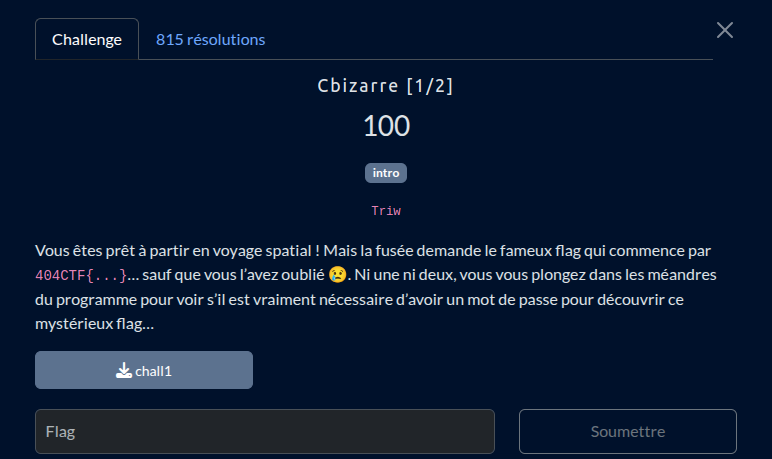

Une fois le binaire load avec [Ghidra](https://github.com/NationalSecurityAgency/ghidra) on remarque un lien suspect, un pastbin

```c

undefined8 main(int param_1,undefined8 *param_2)

{
  uchar *key;
  int iVar1;
  undefined8 uVar2;
  EVP_CIPHER *cipher;
  int local_16c;
  uchar local_168 [128];
  uchar local_e8 [132];
  undefined4 local_64;
  undefined4 local_60;
  undefined4 local_5c;
  long local_58;
  char *local_50;
  int local_44;
  EVP_CIPHER_CTX *local_40;
  int local_34;
  size_t local_30;
  char *local_28;
  ulong local_20;
  
  if (param_1 == 2) {
    local_28 = 
    "b457cbb3a588fda49339744bdeff34ca0885bb3b630dbdb57fcbab5595d64a49a5338b5efe8e7cfdccb75fd137b172f a5dcc5e47748d2ed55f7ccad26829670b9eeb98ded4429c4d66f01dd5ddbd2c2668ba4b666e29d206dbcdec0e11ebb5d 53a0de62612ed923beda79aea3dae06a05efe67f4c3dec8f92ecbaa3a1c16e8693ef93aa28b962e39e2bf1308b0d46f6 1"
    ;
    local_30 = strlen(
                     "b457cbb3a588fda49339744bdeff34ca0885bb3b630dbdb57fcbab5595d64a49a5338b5efe8e7c fdccb75fd137b172fa5dcc5e47748d2ed55f7ccad26829670b9eeb98ded4429c4d66f01dd5ddbd2 c2668ba4b666e29d206dbcdec0e11ebb5d53a0de62612ed923beda79aea3dae06a05efe67f4c3de c8f92ecbaa3a1c16e8693ef93aa28b962e39e2bf1308b0d46f61"
                     );
    for (local_20 = 0; local_20 < local_30 >> 1; local_20 = local_20 + 1) {
      __isoc99_sscanf(local_28 + local_20 * 2,"%2hhx",local_e8 + local_20);
    }
    local_34 = (int)(local_30 >> 1);
    local_40 = EVP_CIPHER_CTX_new();
    key = (uchar *)param_2[1];
    cipher = EVP_aes_128_ecb();
    EVP_DecryptInit_ex(local_40,cipher,(ENGINE *)0x0,key,(uchar *)0x0);
    EVP_DecryptUpdate(local_40,local_168,&local_16c,local_e8,local_34);
    local_44 = local_16c;
    EVP_DecryptFinal_ex(local_40,local_168 + local_16c,&local_16c);
    local_44 = local_44 + local_16c;
    local_168[local_44] = '\0';
    EVP_CIPHER_CTX_free(local_40);
    local_50 = 
    "AV5Ukqn7VMi@z08w71WCzJd6$G*EF#fhsF2taRxYxccVXwk!Uc7@QsBUgZzFVXz1p7vBlmpUILL$T7#8@#WNE#68JW$AamQ YJlsrQj#NZkb%n&5DqA*pQ67X&OVp68BN"
    ;
    iVar1 = strcmp((char *)local_168,
                   "AV5Ukqn7VMi@z08w71WCzJd6$G*EF#fhsF2taRxYxccVXwk!Uc7@QsBUgZzFVXz1p7vBlmpUILL$T7#8 @#WNE#68JW$AamQYJlsrQj#NZkb%n&5DqA*pQ67X&OVp68BN"
                  );
    if (iVar1 == 0) {
      local_58 = curl_easy_init();
      if (local_58 == 0) {
        fwrite("Failed to initialize CURL\n",1,0x1a,stderr);
        uVar2 = 1;
      }
      else {
        local_5c = 0x2712;
        curl_easy_setopt(local_58,0x2712,"https://pastebin.com/raw/n8CXuwE0");
        local_60 = 0x4e2b;
        curl_easy_setopt(local_58,0x4e2b,write_callback);
        local_64 = curl_easy_perform(local_58);
        curl_easy_cleanup(local_58);
        uVar2 = 0;
      }
    }
    else {
      fwrite("Decrypted message does not match expected message\n",1,0x32,stderr);
      uVar2 = 1;
    }
  }
  else {
    fprintf(stderr,"Usage: %s <password>\n",*param_2);
    uVar2 = 1;
  }
  return uVar2;
}
```

le flag ! 
https://pastebin.com/raw/n8CXuwE0