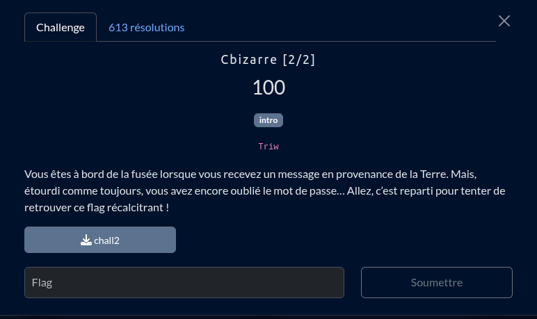

Une fois le binaire load avec [Ghidra](https://github.com/NationalSecurityAgency/ghidra) on remarque qu'il y a un check sur chaque chractere de l'argument donné `argv[1]` une fois le check passé le flag est retrouvé après être `xor` avec une clé, pour le coup le printf est explicite sur où se trouve le flag 

```c


undefined8 main(int param_1,undefined8 *argv)

{
  undefined8 ret;
  size_t fleglen;
  undefined8 key;
  undefined5 local_20;
  undefined3 uStack_1b;
  undefined5 uStack_18;
  undefined8 flag;
  
  if (param_1 == 2) {
    fleglen = strlen((char *)argv[1]);
    if (fleglen == 0x14) {
      if (*(char *)(argv[1] + 5) != 'Z') {
        fwrite("Error: Incorrect password.\n",1,0x1b,stderr);
                    /* WARNING: Subroutine does not return */
        exit(1);
      }
      if (*(char *)(argv[1] + 0xc) != 'o') {
        fwrite("Error: Incorrect password.\n",1,0x1b,stderr);
                    /* WARNING: Subroutine does not return */
        exit(1);
      }
      if (*(char *)argv[1] != 'f') {
        fwrite("Error: Incorrect password.\n",1,0x1b,stderr);
                    /* WARNING: Subroutine does not return */
        exit(1);
      }
      if (*(char *)(argv[1] + 0x12) != '1') {
        fwrite("Error: Incorrect password.\n",1,0x1b,stderr);
                    /* WARNING: Subroutine does not return */
        exit(1);
      }
      if (*(char *)(argv[1] + 7) != '%') {
        fwrite("Error: Incorrect password.\n",1,0x1b,stderr);
                    /* WARNING: Subroutine does not return */
        exit(1);
      }
      if (*(char *)(argv[1] + 3) != 'M') {
        fwrite("Error: Incorrect password.\n",1,0x1b,stderr);
                    /* WARNING: Subroutine does not return */
        exit(1);
      }
      if (*(char *)(argv[1] + 9) != 'y') {
        fwrite("Error: Incorrect password.\n",1,0x1b,stderr);
                    /* WARNING: Subroutine does not return */
        exit(1);
      }
      if (*(char *)(argv[1] + 0x10) != 'v') {
        fwrite("Error: Incorrect password.\n",1,0x1b,stderr);
                    /* WARNING: Subroutine does not return */
        exit(1);
      }
      if (*(char *)(argv[1] + 0xe) != 'n') {
        fwrite("Error: Incorrect password.\n",1,0x1b,stderr);
                    /* WARNING: Subroutine does not return */
        exit(1);
      }
      if (*(char *)(argv[1] + 1) != 'a') {
        fwrite("Error: Incorrect password.\n",1,0x1b,stderr);
                    /* WARNING: Subroutine does not return */
        exit(1);
      }
      if (*(char *)(argv[1] + 0x13) != 'x') {
        fwrite("Error: Incorrect password.\n",1,0x1b,stderr);
                    /* WARNING: Subroutine does not return */
        exit(1);
      }
      if (*(char *)(argv[1] + 6) != 'a') {
        fwrite("Error: Incorrect password.\n",1,0x1b,stderr);
                    /* WARNING: Subroutine does not return */
        exit(1);
      }
      if (*(char *)(argv[1] + 0xf) != 'M') {
        fwrite("Error: Incorrect password.\n",1,0x1b,stderr);
                    /* WARNING: Subroutine does not return */
        exit(1);
      }
      if (*(char *)(argv[1] + 8) != '3') {
        fwrite("Error: Incorrect password.\n",1,0x1b,stderr);
                    /* WARNING: Subroutine does not return */
        exit(1);
      }
      if (*(char *)(argv[1] + 4) != 'P') {
        fwrite("Error: Incorrect password.\n",1,0x1b,stderr);
                    /* WARNING: Subroutine does not return */
        exit(1);
      }
      if (*(char *)(argv[1] + 0xb) != 'K') {
        fwrite("Error: Incorrect password.\n",1,0x1b,stderr);
                    /* WARNING: Subroutine does not return */
        exit(1);
      }
      if (*(char *)(argv[1] + 10) != 'N') {
        fwrite("Error: Incorrect password.\n",1,0x1b,stderr);
                    /* WARNING: Subroutine does not return */
        exit(1);
      }
      if (*(char *)(argv[1] + 0x11) != '%') {
        fwrite("Error: Incorrect password.\n",1,0x1b,stderr);
                    /* WARNING: Subroutine does not return */
        exit(1);
      }
      if (*(char *)(argv[1] + 2) != 'V') {
        fwrite("Error: Incorrect password.\n",1,0x1b,stderr);
                    /* WARNING: Subroutine does not return */
        exit(1);
      }
      if (*(char *)(argv[1] + 0xd) != '@') {
        fwrite("Error: Incorrect password.\n",1,0x1b,stderr);
                    /* WARNING: Subroutine does not return */
        exit(1);
      }
      key = 0x661a1c040e625152;
      local_20 = 0x492f7e4954;
      uStack_1b = 0x200233;
      uStack_18 = 0x5026906;
      flag = xor(&key,argv[1],0x14);
      printf("Bravo ! Vous avez le flag ! %s\n",flag);
      ret = 0;
    }
    else {
      fwrite("Error: Incorrect password.\n",1,0x1b,stderr);
      ret = 1;
    }
  }
  else {
    fprintf(stderr,"Usage: %s <password>\n",*argv);
    ret = 1;
  }
  return ret;
}
```


 
le flag ! 
https://pastebin.com/raw/n8CXuwE0