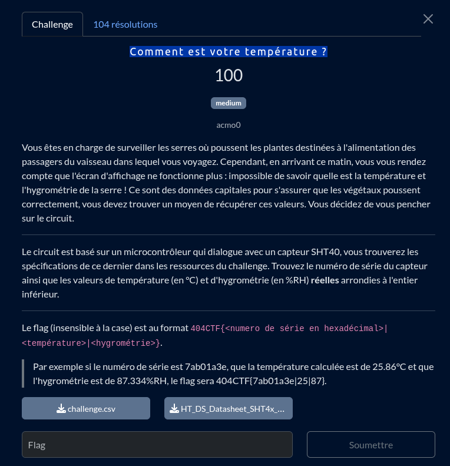
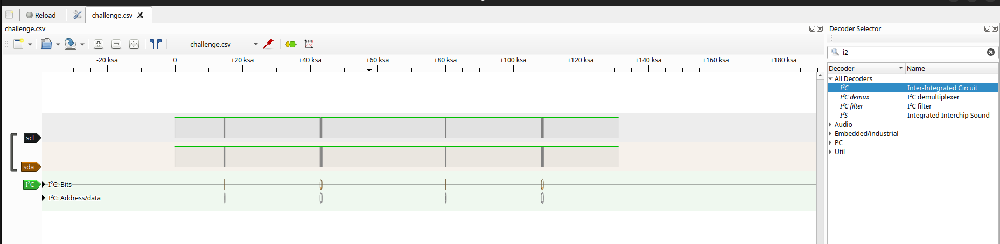
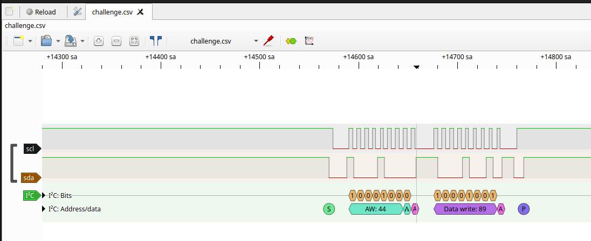
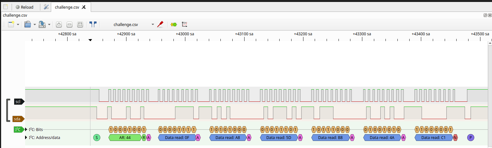
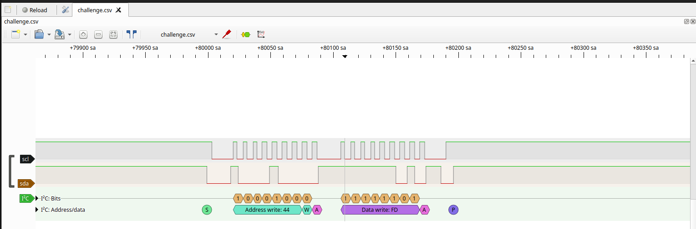
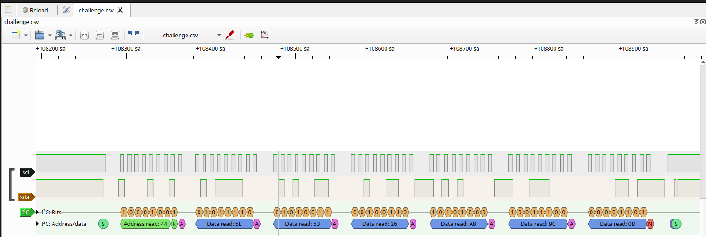

<br>
<br>

## ressources utiles
- **[Pulseview](https://sigrok.org/wiki/PulseView)**: https://sigrok.org/wiki/Downloads

<br>
<br>

## Étape 1 : Import du dump I2C dans PulseView
1. Ouvrir PulseView
- PulseView est un logiciel d’analyse de signaux logiques, parfait pour analyser un bus I2C.

2. Importer le .csv
- Fichier > Ouvrir > Sélectionnez le dump .csv (généralement contenant deux colonnes, SCL/SDA) mais ici nos colonne seront `logic` et `logic` à nous de les renomer comme il se doit. 

> [!NOTE]
> Il se peut que vous ne voyez pas vos fichier lors de l'import, juste spécifié "voir tout les fichiers" en bas à droite de votre fenêtre

3. Configurer l’analyseur I2C
- Ajouter un “I2C Decoder” dans PulseView.

- Associer les bonnes lignes : SCL et SDA (à la place de nos 2 colonne logic).

une fois ce boulot fait on obtient notre dump décodé.


<br>
<br>

## Étape 2 : I2C Communication
Pour comprendre comment interpréter ces datas décodé il est important de comprendre le mode de communication `I2C` très bien expliqué au [*chapitre 4*](./resources/HT_DS_Datasheet_SHT4x_5.pdf)

<br>

## Étape 2.1 : Identification des transactions importantes
Consulter la [datasheet SHT40](./resources/HT_DS_Datasheet_SHT4x_5.pdf) donne les commandes à surveiller dans la section **4.5 Command Overview** (page 12) :

**Lecture du numéro de série** :
- Écriture (`WRITE`) à l’adresse `0x44` avec la commande `0x89`
- Lecture (`READ`) juste après, qui retourne 6 octets : `[SN1_MSB, SN1_LSB, CRC, SN2_MSB, SN2_LSB, CRC]`

Donc on trouvera comme 1er transaction notre `Numero de serie`


puis la data qui la suit:


<br>

**Lecture température et humidité** :
- Écriture à `0x44` avec la commande `0xFD` (mesure haute précision)
- Lecture de 6 octets : `[T_MSB, T_LSB, CRC, RH_MSB, RH_LSB, CRC]`

Et donc l'unique transaction restante notre `Temperature` + `humidité`


puis la data qui la suit:


<br>
<br>

## Étape 3 : Extraction des données
Numéro de série :
- Prenez les 4 premiers octets utiles (ignorez les CRC, soit 3e et 6e octet)
- Concaténez-les en hexadécimal (attention à l’ordre : généralement MSB en premier)

Température & humidité récupérez :

- `T_MSB`, `T_LSB` → convertir en `t_ticks `: `t_ticks = (T_MSB << 8) + T_LSB`

- `RH_MSB`, `RH_LSB` → `rh_ticks = (RH_MSB << 8) + RH_LSB`

<br>
<br>

## Étape 4 : Conversion en valeurs physiques
D’après la datasheet (section 4.6), les formules sont :

- Température (°C) :
```bash
T = -45 + 175 * t_ticks / 65535
```

- Humidité relative (%) :
```bash
RH = -6 + 125 * rh_ticks / 65535
```

- Arrondir à l’entier inférieur chaque valeur.

Exemple :

```python
T_MSB = 0x5E ; T_LSB = 0x53 ⇒ t_ticks = 0x5E53 = 24147
T = -45 + 175 * 24147 / 65535 ≈ 19.48 ⇒ 19
RH_MSB = 0xA8 ; RH_LSB = 0x9C ⇒ rh_ticks = 0xA89C = 43164
RH = -6 + 125 * 43164 / 65535 ≈ 76.33 ⇒ 76
```

<br>
<br>

## Étape 5 : Construction du flag

Avec :

- **Numéro de série** : 0fa8b84a

- **Température** : 19

- **Humidité** : 76

Le flag attendu est :
```bash
404CTF{0fa8b84a|19|76}
```

<br>
<br>

## Conclusion & Conseils
- Le plus long est souvent de repérer les bons échanges I2C dans le flux (utilisez le filtre dans PulseView pour voir seulement les transmissions à l’adresse 0x44 et commande 0xFD/0x89).

- Toujours vérifier les CRC si plusieurs mesures sont présentes (pour choisir les bonnes !).

- Les conversions sont documentées dans la datasheet, bien lire la partie “conversion formula”.

<br>
<br>

## Bonus : Script Python
Si besoin de refaire le calcul à la main, voici un mini-script Python :

```python
def sht40_temp(t_msb, t_lsb):
    t_ticks = (t_msb << 8) + t_lsb
    return -45 + 175 * t_ticks / 65535

def sht40_rh(rh_msb, rh_lsb):
    rh_ticks = (rh_msb << 8) + rh_lsb
    return -6 + 125 * rh_ticks / 65535

print(int(sht40_temp(0x5E, 0x53)))  # 19
print(int(sht40_rh(0xA8, 0x9C)))    # 76
```

Voilà !
Ce challenge est une belle introduction à l’analyse de bus I2C, à la compréhension des datasheets et au décodage de protocoles binaires.
