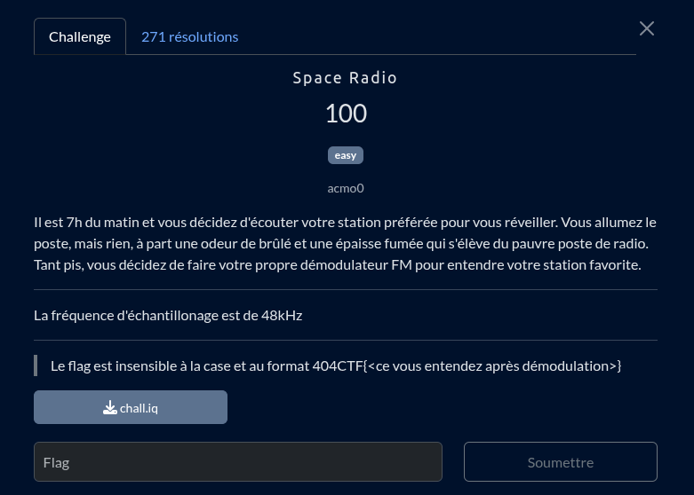
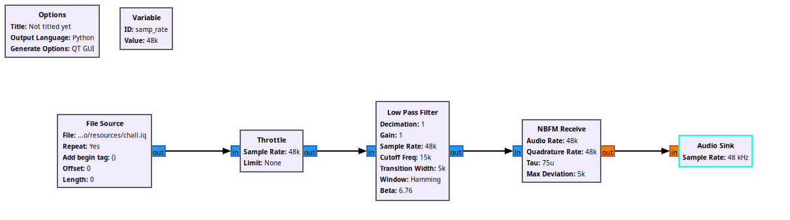

A simple FM demodulation, we are already give the IQ file of raw capture, for that one I'll use 
Une simple démodulation FM, on nous donne déjà le fichier IQ de la capture brut, pour celui là j'utilise [*gnu-radio*](https://www.gnuradio.org/)

un logiciel poen source qui permet de faire tout un tas de merveille avec les radio frequences.

En utilisant ce logiciel, chatGPT nous offre facilement les étapes à suivre 

 
 

## 🛠️ Step-by-Step GNU Radio Flowgraph
✅ ***Block Setup***:
1. **File Source**
- **File**: Your I/Q recording file
- **Output Type**: Complex
- **Repeat**: No
2. Throttle (only needed if no real-time source)
- **Sample Rate**: 48e3
3. Low Pass Filter (optional but recommended)
- **Input Type**: Complex
- **Sample Rate**: 48e3
- **Cutoff freq**: 15e3
- **Transition**: 5e3
4. NBFM Receive
- **Quadrature Rate**: 48e3
- **Audio Rate**: 48e3 (you'll be able to send this directly to your audio sink)
- (This block demodulates narrowband FM — perfect for speech-level FM signals)
5. Audio Sink
- **Sample Rate**: 48e3

Une fois tout les blocs connecté entre eux on peut lancer la démodulation, le logiciel nous donne même la version python de l'ensemble du workflow [ici](./gnu.py)

