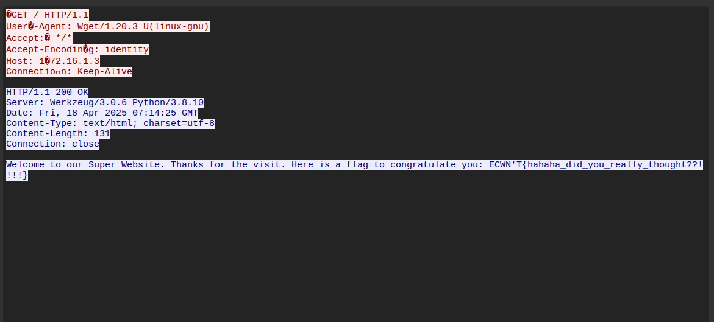
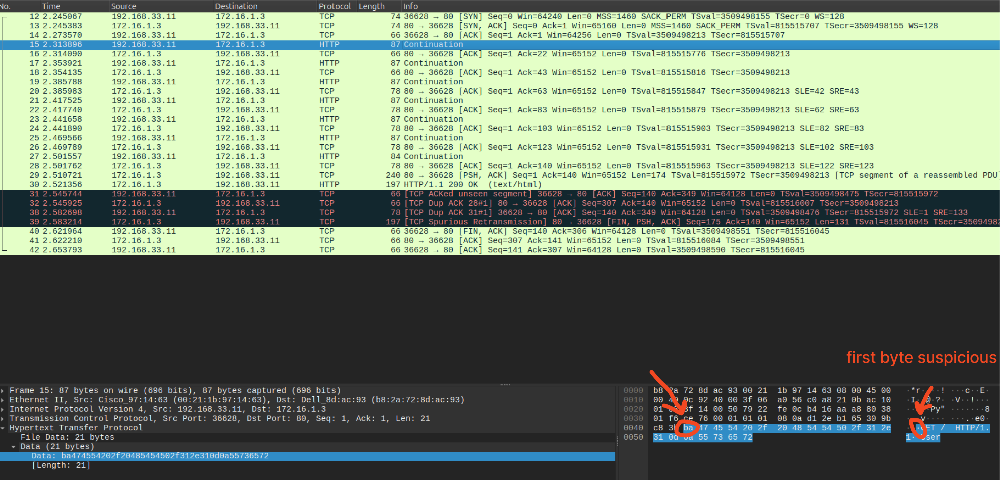

# The Silent Packets

**ID:** 41

**Category:** reverse

**Type:** dynamic

**Value:** 500

**Tags:** medium

## Notes


## 1. Find kernel module

The malicious injected kernel is located `kernel/fs/kern_http.ko`
once reversing it, you can find it decrypting a .jpg embedded in the module.

## 2. Fin.. Guess the key 

unfortunatly the key is not in the module itself, but looking closely at the `pcap` dump we can find a suspicious http stream 



the first packets seems to have glitched header value, when inspecting each packets we find a complete word hidden **"bada55c0ffee"** 



This is in fact the key to use to decrypt the embedded image

## 3. Decrypt

we just have to extract all the encrypted content reverse engeneering the `kern_http.ko` we can gather key informations like its offset `0xc00` and its size `0xd6ba0`

```bash
dd if=./kernel/fs/kern_http.ko of=./logo.jpg.enc bs=1 skip=$((0xc00)) count=$((0xd6ba0))
```

and then just write a script to decrypt it as jpg


**Algo:** AES-CBC
**IV:** `16 * b"\x00"` bytes
**Key:** md5("bada55c0ffee") (yes as string not bytes, another guess)

```python
from hashlib import md5
from Cryptodome.Cipher import AES

def decrypt_blob():
    """Decrypt the encrypted blob"""
    print("[+] Step 1: Decrypting blob...")

    with open('logo.jpg.enc', 'rb') as f:
        ciphertext = f.read()

    key = md5("bada55c0ffee".encode()).digest()
    cipher = AES.new(key, AES.MODE_CBC, b"\x00"*16)
    plaintext = cipher.decrypt(ciphertext)

    print(f"    Decrypted {len(plaintext)} bytes")
    print(f"    Key: {key.hex()}")

    return plaintext

def main():
    print("="*60)
    print("The Silent Packets - Final Solution")
    print("="*60)

    decrypted = decrypt_blob()

    with open('logo.jpg', 'wb') as f:
        f.write(decrypted)
    print("    Saved to: logo.jpg")


if __name__ == '__main__':
    main()
```


## 4. Steghide

During my reverse part I stumbled over interesting information from that kernel module 

```bash
➜  solve git:(master) ✗ modinfo ./kernel/fs/kern_http.ko

# filename:       /home/john/Desktop/CTFs/2025/ECWCTF/reverse/The_Silent_Packets/solve/./kernel/fs/kern_http.ko
# version:        0.5
# description:    Jevgrf fgrtnab uvqqra svyr jurer gur synt vf rzoorqrq hfvat gur nhgube nf cnffjbeq ;-)
# author:         M&NTIS
# license:        GPL
# srcversion:     9D6A3F0AA63AB3549A8BEDB
# depends:        
# retpoline:      Y
# name:           kern_http
# vermagic:       5.15.0-136-generic SMP mod_unload modversions 
# parm:           key:Key used for AES decryption (MD5-derived) (charp)
```

The description is *ROT13* encoded, once decoded we do have 

```bash
Writes stegano hidden file where the flag is embedded using the author as password ;-)
```

Then with a final steghide command 

```bash
steghide extract -sf logo.jpg -p "M&NTIS"
#wrote extracted data to "flag.txt".
cat flag.txt 
#ECW{gg_U_d4s4rv3_a_c00kie_but_h3r3_is_a_Fl4G}
```
