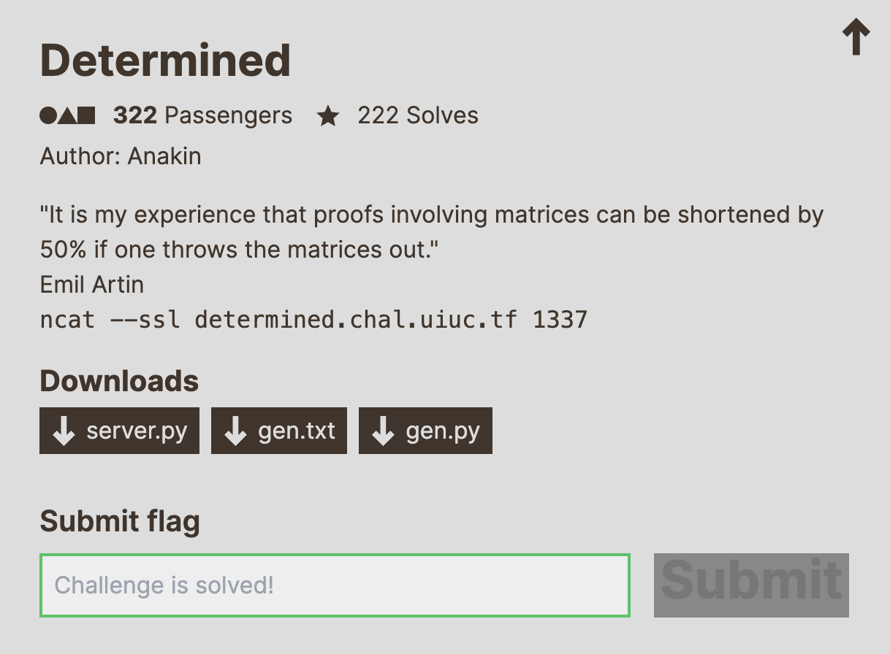

<br />

## 📃 Table of contents
- [📚 Resources](#resources)
- [🔎 Analysis](#analysis)
- [💡 Solving](#solving)
- [🚩 Solution](#solution)
- [👨‍💻 Author](#author)

<br />
<br />

## Resources
- **RSA cryptosystem**:
    - wikipedia: https://en.wikipedia.org/wiki/RSA_(cryptosystem)
    - How does RSA Cryptography work ?: https://www.youtube.com/watch?v=qph77bTKJTM
    - The Mathematical Cryptography of the RSA Cryptosystem: https://nitaj.users.lmno.cnrs.fr/RSAnitaj1.pdf
- **determinant**:
    - What is a determinant ?: https://www.youtube.com/watch?v=Ip3X9LOh2dk
    - Example of a Determinant of a Matrix: https://www.mathsisfun.com/algebra/matrix-determinant.html
    - determinant calculator: https://matrix.reshish.com/detCalculation.php

<br />
<br />

## Analysis

We are given with the challenge 2 files `server.py` and `gen.py`. With that, we also have an endpoint connection `ncat --ssl determined.chal.uiuc.tf 1337`

<br />
<br />

### *gen.py*
```python
from SECRET import FLAG, p, q, r
from Crypto.Util.number import bytes_to_long
n = p * q
e = 65535 
m = bytes_to_long(FLAG)
c = pow(m, e, n)
# printed to gen.txt
print(f"{n = }")
print(f"{e = }")
print(f"{c = }")
```
### *gen.txt*:
```
n = 158794636700752922781275926476194117856757725604680390949164778150869764326023702391967976086363365534718230514141547968577753309521188288428236024251993839560087229636799779157903650823700424848036276986652311165197569877428810358366358203174595667453056843209344115949077094799081260298678936223331932826351
e = 65535
c = 72186625991702159773441286864850566837138114624570350089877959520356759693054091827950124758916323653021925443200239303328819702117245200182521971965172749321771266746783797202515535351816124885833031875091162736190721470393029924557370228547165074694258453101355875242872797209141366404264775972151904835111
```

<br/>

At first glance it is likely that the `FLAG` appears to be ciphered using RSA algorithm.
And hopefully some of the key variable to RSA are given to us in [gen.txt](./gen.txt) => `n`, `e`, `c`.

<br/>

Lets review all of them:
- `n`: Is the multiplication of 2 prime numbers `p * q` that produce the *modulus* used for ciphering and deciphering.
- `e`: Set to `65535` is the *public key* that serve has exponent for the encryption part.
- `m`: The actual message converted into a big number `bytes_to_long(FLAG)` and that also will serve as the *base* number during encryption.
- `c`: The *ciphered* message `pow(m, e, n)`

<br>

To resume here is the four operation in its mathematical representation (RSA encryption): 
 
$$
c = m^e \mod n
$$

<br />
<br />

Well,  
the good news is that the flag is already here *ciphered* in our computer  
the bad news is that we don't know about `p` and `q` which is needed to find exponent `d` the modular inverse (AKA *private key*)  
  
Lets see the next file...

<br />

>[!TIP]
>We are not going into the details of RSA but before going any further I higly recommend you to understand how RSA encryption works if you don't know yet => [📚 Resources](#resources)

<br />
<br />

### *server.py*:
```python
from Crypto.Util.number import bytes_to_long, long_to_bytes
from itertools import permutations
from SECRET import FLAG, p, q, r

def inputs():
    print("[DET] First things first, gimme some numbers:")
    M = [
        [0, 0, 0, 0, 0],
        [0, 0, 0, 0, 0],
        [0, 0, 0, 0, 0],
        [0, 0, 0, 0, 0],
        [0, 0, 0, 0, 0],
    ]
    try:
        M[0][0] = p
        M[0][2] = int(input("[DET] M[0][2] = "))
        M[0][4] = int(input("[DET] M[0][4] = "))

        M[1][1] = int(input("[DET] M[1][1] = "))
        M[1][3] = int(input("[DET] M[1][3] = "))

        M[2][0] = int(input("[DET] M[2][0] = "))
        M[2][2] = int(input("[DET] M[2][2] = "))
        M[2][4] = int(input("[DET] M[2][4] = "))

        M[3][1] = q
        M[3][3] = r

        M[4][0] = int(input("[DET] M[4][0] = "))
        M[4][2] = int(input("[DET] M[4][2] = "))
    except:
        return None
    return M

def handler(signum, frame):
    raise Exception("[DET] You're trying too hard, try something simpler")

def fun(M):
    def sign(sigma):
        l = 0
        for i in range(5):
            for j in range(i + 1, 5):
                if sigma[i] > sigma[j]:
                    l += 1
        return (-1)**l

    res = 0
    for sigma in permutations([0,1,2,3,4]):
        curr = 1
        for i in range(5):
            curr *= M[sigma[i]][i]
        res += sign(sigma) * curr
    return res

def main():
    print("[DET] Welcome")
    M = inputs()
    if M is None:
        print("[DET] You tried something weird...")
        return

    res = fun(M)
    print(f"[DET] Have fun: {res}")

if __name__ == "__main__":
    main()
```

This is the service hosted server-side, it is really simple to understand, we just provide the server 9 values and the server will put those values in a square matrix array at specific index as defined in [inputs](./server.py) function then once the square matrix populated the server will calculate the **determinant** and return it to us.

Lets review the functions one by one:
- `main`: The entrypoint, we will fall to `inputs` then the server just check that every value is alright then calculate its **determinant**.
- `inputs`: The most important for us as we will only be able to provide values the 9 values there.
- `fun`: The functions only purpose is to calculate the **determinant** of its param `M` a square matrix.
- `handler`: This function does not seem tp be used.

<br />

After reading it all we remark something really interesting, the values `q` and `p` ! The same ones that has been used to *cipher* the flag has been hard coded in this square matrix array.
The fact that we are already given `n` we would only need to get either `q` or `p` to be able to compute the *private key* and *decipher* the *ciphered* message `c`.

<br />
<br />

## Solving

>[!TIP]
>Understanding the meaning of **Determinant** in matrices can be helpful. Refer to this [YouTube video](https://www.youtube.com/watch?v=Ip3X9LOh2dk) for more details. 

<br />

As stated in the previous step we need to find a way to extract the `q` or `p` value from that Matrix array as they are hard coded into so in my research to undestand the **Dterminent** and its computation.  

<br />

I found an interesting [article](https://www.mathsisfun.com/algebra/matrix-determinant.html) explaining the process of calculation called ***Laplace expansion***.  
***Laplace expansion***, is a method used to calculate the determinant of a square matrix. It involves breaking down a larger determinant into smaller ones, it is not the only one but it this one that made me think of a solution.  

<br />

We can understand that values are being multiplied with their opposite part within the next row then if we could get a way to manage to pull up the value `q` in the first row and setting all the other value by multiplaying them by 0 then we would end up with a first row of full 0 and the value `q`.

<br />

Lets see now how the square matrix `M` is being initialized and how we can infer with our 9 values into it, where `Vn` are values we can input  

<br />

$$
\begin{pmatrix}
p & 0 & v1 & 0 & v2\\\ 
0 & v3 & 0 & v4 & 0\\\
v5 & 0 & v6 & 0 & v7\\\
0 & q & 0 & r & 0\\\
v8 & 0 & v9 & 0 & 0\\\
\end{pmatrix}
$$

<br />
<br />

So after playing multiple combination in [test.py](./test.py) mocking the values `p`, `q`, `r` I finally found a good combination !
### *test.py*
```python
from server import fun

q = 61
r = 12
p = 17

M = [
    [p, 0, 0, 0, 1],
    [0, 0, 0, 1, 0],
    [0, 0, 1, 0, 0],
    [0, q, 0, r, 0],
    [1, 0, 0, 0, 0],
]

Q = fun(M)
# Q => 61 🥳
# We can see that only q is being returned
```

We now have the full steps to get the flag in clear !  
Lets proceed to the full solution 🔥.

<br />
<br />

## solution

### solution.py
```python
from Crypto.Util.number import inverse, long_to_bytes
import ssl
import socket

URL = "determined.chal.uiuc.tf"
PORT = 1337

# This function will attempt to exctract the "q" value hardcoded in the matrix of the server
#
def get_q():
    # Create a socket object
    client_socket = socket.socket(socket.AF_INET, socket.SOCK_STREAM)
    # Wrap the socket with SSL
    context = ssl.create_default_context()
    ssl_socket = context.wrap_socket(client_socket, server_hostname=URL)

    try:
        # Connect to the server
        ssl_socket.connect((URL, PORT))
        print(f"Connected to server {URL} on port {PORT}\n")

        # Loop over all the values asked by the server (see function "inputs" in server.py )
        inputs = ['0','1','0','1','0','1','0','1','0']
        for input in inputs:
            response = ssl_socket.recv(4096)
            answer = input + "\n"
            ssl_socket.sendall(answer.encode())

        # Get back the determinant of the matrix
        response = ssl_socket.recv(4096).decode()
        q = int(response.split(" ")[-1])

        return q

    except Exception as e:
        print(f"An error occurred: {e}")


if __name__ == "__main__":
    # 1.
    n = 158794636700752922781275926476194117856757725604680390949164778150869764326023702391967976086363365534718230514141547968577753309521188288428236024251993839560087229636799779157903650823700424848036276986652311165197569877428810358366358203174595667453056843209344115949077094799081260298678936223331932826351
    e = 65535
    c = 72186625991702159773441286864850566837138114624570350089877959520356759693054091827950124758916323653021925443200239303328819702117245200182521971965172749321771266746783797202515535351816124885833031875091162736190721470393029924557370228547165074694258453101355875242872797209141366404264775972151904835111

    # 2.
    q = get_q() 
    p = n // q

    # 3. 
    phi_n = (p - 1) * (q - 1)
    d = inverse(e, phi_n)

    # 4.
    m = pow(c, d, n)

    # 5. 
    flag = long_to_bytes(m)
    print(''.join([ chr(c) for c in flag ]))
```

### Step-by-step-rsa-decryption

1. We will set `n`, `e`, `c` as given in [gen.txt](./gen.py)
2. We get the `q` value calling the server and giving him the inputs that match the array found in [test.py](./test.py). Once q in possession we can find back `p` by diving `n` with `q`
>[!NOTE]
>A subtile detail but since we are dealing with very big number we are forced to do a python [*floor division*](https://chatgpt.com/share/b843ac10-d2f6-4337-b120-45f49353018b) to get the exact right big number
3. Compute ϕ(n), then make the modular multiplicative inverse of 𝑒 modulo 𝜙(𝑛) to get `d` (AKA rhe *private key*)
>[!TIP]
>Feel free to check the [📚 resource](#resources) that explain how encryption/decryption is done with ***RSA***
4. With `d` now in possession we can decrypt the ciphertext
5. Convert m back to bytes to recover the FLAG 🥳

<br />
<br />

## Author

**Tondelier Jonathan**